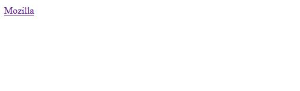
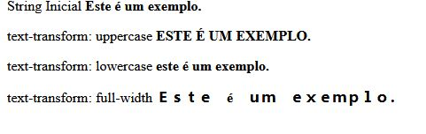
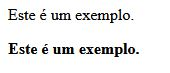
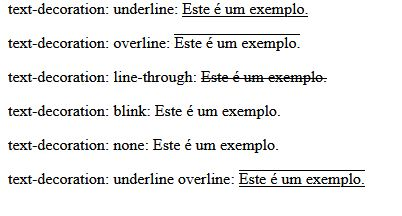
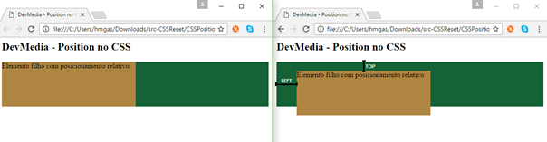
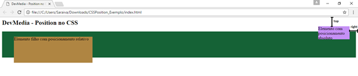
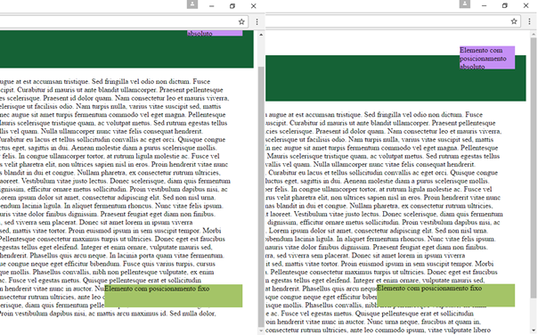
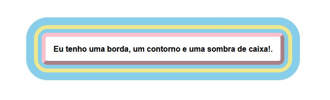
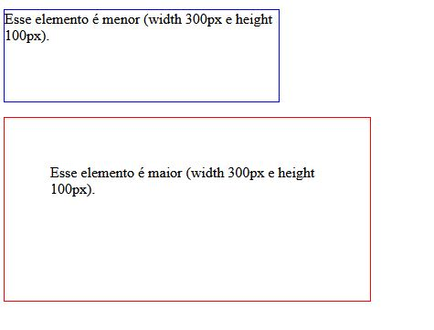
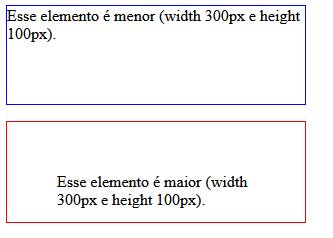

## Sumário

- [Navegação Entre Páginas](#navegação-entre-páginas)
- [Capitalizando o Texto](#capitalizando-o-texto)
- [Deixando Texto em Negrito](#deixando-texto-em-negrito)
- [Decorando o Texto](#decorando-o-texto)
- [reset.css](#resetcss)
- [Posicionamento de Elementos](#posicionamento-de-elementos)
  * [Posicionamento Relativo](#posicionamento-relativo)
  * [Posicionamento Absoluto](#posicionamento-absoluto)
  * [Posicionamento Fixo](#posicionamento-fixo)
- [Definindo Bordas](#definindo-bordas)
- [A tag main](#a-tag-main)
- [Box-Sizing](#box-sizing)
- [inline-block](#inline-block)
- [Pseudo Classes do CSS](#pseudo-classes-do-css)
- [A tag footer](#a-tag-footer)
- [Inserindo Imagem de Fundo](#inserindo-imagem-de-fundo)


## Navegação Entre Páginas

O elemento [<a>](https://developer.mozilla.org/pt-BR/docs/Web/HTML/Element/a) em HTML (ou elemento âncora), com o atributo **href** cria-se um hiperligação nas páginas web, arquivos, endereços de emails, ligações na mesma página ou endereços na URL. O conteúdo dentro de cada `<a>` precisará indicar o destino do link.

```html
<a href="https://www.mozilla.com">
  Mozilla
</a>
```



[Voltar ao Topo](#Sumário)

## Capitalizando o Texto

A propriedade de CSS [text-transform](https://developer.mozilla.org/pt-BR/docs/Web/CSS/text-transform) especifica como capitalizar um texto de um elemento. Pode ser usado para que o texto apareça com todas as letras maiúsculas ou todas minúsculas, ou com cada palavra em maiúscula. 

```css
.exemplo1 {
  text-transform: uppercase;
}
.exemplo2 {
  text-transform: lowercase;
}
.exemplo3 {
  text-transform: full-width;
}
```



[Voltar ao Topo](#Sumário)

## Deixando Texto em Negrito

A propriedade CSS [font-weight](https://developer.mozilla.org/pt-BR/docs/Web/CSS/font-weight) especifica o peso ou a intensidade da fonte (ex.: negrito). Algumas fontes oferecem apenas as opções normal e negrito. 

```css
.exemplo1 {
  font-weight: normal;
}
.exemplo2 {
  font-weight: bold;
}
```



[Voltar ao Topo](#Sumário)

## Decorando o Texto

A propriedade [text-decoration](https://developer.mozilla.org/pt-BR/docs/Web/CSS/text-decoration) do CSS é usada para definir a formatação de  underline, overline, line-through ou blink. As decorações underline e overline são posicionadas abaixo e acima do texto (respectivamente), e line-through cortando-o. 

```css
.exemplo1 {
    text-decoration: underline;
}
.exemplo2 {
    text-decoration: overline;
}
.exemplo3 {
    text-decoration: line-through;
}
.exemplo4 {
    text-decoration: blink;
}
.exemplo5 {
    text-decoration: none;
}
.exemplo6 {
    text-decoration: underline overline;
}
```



[Voltar ao Topo](#Sumário)

## reset.css

Cada navegador tem a sua apresentação por padrão e esse comportamento individualizado pode gerar conflitos de layout diante do seu projeto web.

A técnica do reset css é uma forma de suavizar estas diferenças e padronizar a estilização, sobrepondo a formatação original do browsers com uma folha de estilo 

O arquivo reset.css pode ser encontrado em: http://meyerweb.com/eric/tools/css/reset/ 

```html
<!-- Para utilizar o reset.css basta utilizar a tag link com o arquivo como referência -->
<!-- A tag deve ser utilizada ANTES de outros arquivos .css que estiverem estiliando a página -->
<!-- Se não o estilo será sobreposto -->
<link rel="stylesheet" href="produtos.css">
```

[Voltar ao Topo](#Sumário)

## Posicionamento de Elementos

A propriedade [position](https://developer.mozilla.org/pt-BR/docs/Web/CSS/position), encontrada no CSS, define como um elemento pode ser posicionado (renderizado) no documento (página).

### Posicionamento Relativo
* A primeira opção de posicionamento para um elemento é a **relative**. Como o nome sugere, ela especifica uma posição relativa do elemento em relação a algo: o elemento pai.
* A posição é definida através de quatro outras propriedades: top, bottom, left e right, que indicam a distância com relação ao topo, base, esquerda e direita, respectivamente, tomando como referência o posicionamento do elemento pai.




### Posicionamento Absoluto
* A segunda opção de posicionamento é a **absolute**, ou absoluto. Ela faz com que o elemento “saia” da hierarquia estabelecida pelo HTML – na prática, ele é filho da página e não de um elemento qualquer no HTML definido. Assim, é possível posicionarmos esse elemento em qualquer lugar da página, independentemente do que temos lá. Isso pode ser útil em casos que precisamos posicionar um alerta em nossa página, por exemplo, e não queremos “quebrar” o layout.
* Apesar dessa possibilidade, é importante utilizar o layout absoluto de forma responsável, uma vez que ele, por não fazer parte da hierarquia da página, pode atrapalhar o desenvolvimento responsivo. Assim, o funcionamento em dispositivos com resoluções menores, como tablets e smartphones, pode ser prejudicado.
* Na prática, para um HTML simples, como o apresentado a seguir, o `<div>` será filho de `<body>`. Entretanto, como especificamos um posicionamento absoluto, o elemento pai não nos interessa, uma vez que não consideraremos seu posicionamento como referência



### Posicionamento Fixo
* Embora parecida com o posicionamento absoluto, com **fixed** o elemento “responde”, em termos de layout, ao navegador. Isso significa que, mesmo que naveguemos na página para cima e para baixo, o elemento ficará fixo na mesma posição sempre.
* Esse tipo de posicionamento é especialmente útil em casos de menu, para que o usuário não perca o contato com a navegação enquanto lê uma notícia, por exemplo. Sites com conteúdo extenso costumam adotar essa opção para melhorar a experiência do usuário.
* Para melhor compreender seu funcionamento, vejamos o exemplo da Figura 3, no qual inserimos o texto fictício lorem ipsum na página. Observe que, na janela à direita, a barra de rolagem nos mostra que estamos no topo da página; e, à esquerda, na base da mesma. Note que, em relação ao navegador, o novo elemento está exatamente na mesma posição (no canto inferior direito)



[Voltar ao Topo](#Sumário)

## Definindo Bordas

A propriedade [border](https://developer.mozilla.org/en-US/docs/Web/CSS/border) do CSS configura a borda de um elemento. Determinando os valores `border-width`, `border-style` e `border-color`.

```css
div {
  border: 0.5rem outset pink;
  outline: 0.5rem solid khaki;
  box-shadow: 0 0 0 2rem skyblue;
  border-radius: 12px;
  font: bold 1rem sans-serif;
  margin: 2rem;
  padding: 1rem;
  outline-offset: 0.5rem;
}
```




[Voltar ao Topo](#Sumário)

## A tag main

O elemento [`<main>`](https://developer.mozilla.org/pt-BR/docs/Web/HTML/Element/main) define o conteúdo principal dentro do `<body>` em seu documento ou aplicação. Entende-se como conteúdo principal aquele relacionado diretamente com o tópico central da página ou com a funcionalidade central da aplicação. O mesmo deverá ser único na página, ou seja, dentro do elemento `<main>` não deverão ser incluidas seções da página que sejam comuns a todo o site ou aplicação, tais como mecanismos de navegação, informações de copyright, logotipo e campos de busca (a não ser, é claro,  caso a função principal do documento seja  fazer algum tipo de busca).

[Voltar ao Topo](#Sumário)

## Box-Sizing

A propriedade CSS [box-sizing](https://www.w3schools.com/css/css3_box-sizing.asp) permite incluir o padding e a borda na largura e altura total de um elemento. Por padrão, a largura e a altura de um elemento são calculadas assim:

* largura + padding + borda = largura real de um elemento
* altura + padding + borda = altura real de um elemento

Quando você define a largura / altura de um elemento, o elemento geralmente parece maior do que você definiu (porque a borda e o padding do elemento são adicionados à largura / altura especificada do elemento). A propriedade box-sizing nos permite incluir o preenchimento e a borda na largura e altura total de um elemento. Se você definir o tamanho da caixa: caixa de borda; em um elemento, o preenchimento e a borda são incluídos na largura e na altura:

```css
/** Os dois elementos acabam com tamanhos diferentes no resultado (o segundo tem um padding especificado) **/
.exemplo1 {
  width: 300px;
  height: 100px;
  border: 1px solid blue;
}

.exemplo2 {
  width: 300px;
  height: 100px;
  padding: 50px;
  border: 1px solid red;
}
```



```css
/** Os dois elementos possuem tamanhos iguais no resultado (box-sizing: border-box) **/
.exemplo1 {
  width: 300px;
  height: 100px;
  border: 1px solid blue;
  box-sizing: border-box;
}

.exemplo2 {
  width: 300px;
  height: 100px;
  padding: 50px;
  border: 1px solid red;
  box-sizing: border-box;
}
```


[Voltar ao Topo](#Sumário)

## inline-block

[Voltar ao Topo](#Sumário)

## Pseudo Classes do CSS

A pseudo classe `:hover` em CSS seleciona elementos quando o cursor do mouse está sobre eles. 

```css
a:hover {
  color: green;
  text-decoration: underline overline;
}
```
Então, quando um link como este é "passado" (como um cursor em um dispositivo com um mouse):

```html
<a href="https://google.com">Vá para o Google </a>
```

Ele ficará verde e terá uma linha abaixo e acima dele

A pseudo classe `:active` muda a aparência de um elemento enquanto está sendo ativado (sendo clicado ou ativado). Geralmente, é visto apenas por uma fração de segundo e fornece feedback visual de que o elemento foi realmente clicado.

[Voltar ao Topo](#Sumário)

## A tag footer

O elemento HTML de Rodapé ([`<footer`>](https://developer.mozilla.org/pt-BR/docs/Web/HTML/Element/footer)) representa um rodapé para o seu conteúdo de seção mais próximo ou  elemento (ou seja, seu parente mais próximo `<article>`, `<aside>`, `<nav>`, `<section>`, `<blockquote>`, `<body>`, `<details>`, `<fieldset>`, `<figure>`, `<td>`. Normalmente um rodapé contém informações sobre o autor da seção de dados, direitos autorais ou links para documentos relacionados.

[Voltar ao Topo](#Sumário)

## Inserindo Imagem de Fundo

Pode ser feito passando o parâmetro `url()` seguido do link para a imagem para o comando css `background`

```css
exemplo {
    background: url("exemplo.jpg");
}
```
O CSS, por padrão, copia e cola a imagem diversas vezes até ocupar todo o espaço do elemento

[Voltar ao Topo](#Sumário)

