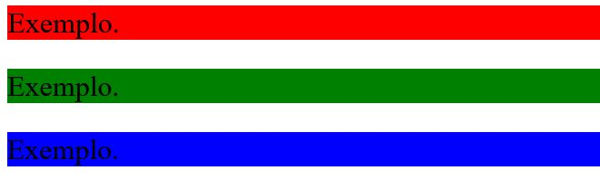
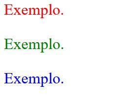
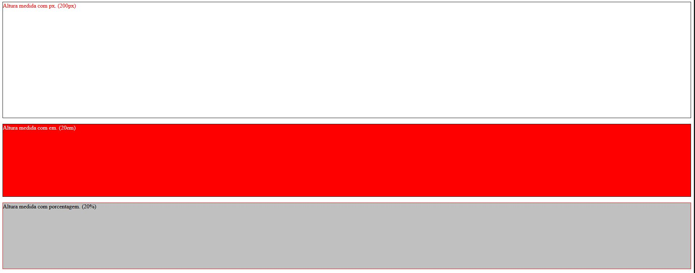
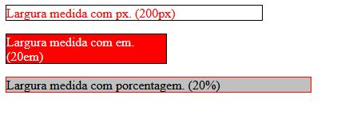
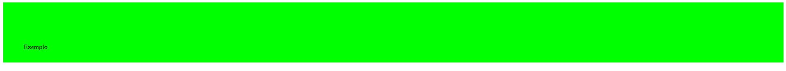
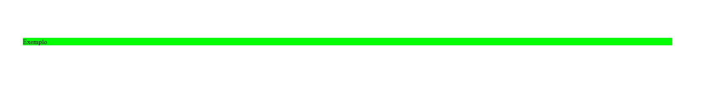
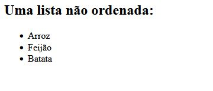
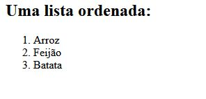

## Sumário
- [Estrutura básica do HTML](#estrutura-básica-do-html)
- [Trabalhando com CSS](#trabalhando-com-css)
  * [Alinhamento dos Textos](#alinhamento-dos-textos)
  * [Tamanhdo da Fonte](#tamanhdo-da-fonte)
  * [Cor de Fundo](#cor-de-fundo)
  * [Cor do Texto](#cor-do-texto)
  * [Representar Cores no CSS](#representar-cores-no-css)
  * [CSS Inline](#css-inline)
  * [CSS Interno](#css-interno)
  * [CSS Externo](#css-externo)
- [Estilizando Imagens](#estilizando-imagens)
  * [Criar um Identificador para Marcar Especificamente um Elemento](#criar-um-identificador-para-marcar-especificamente-um-elemento)
  * [Referenciar um Identificador no CSS](#referenciar-um-identificador-no-css)
  * [Adicionar uma Imagem](#adicionar-uma-imagem)
  * [Altura do Elemento](#altura-do-elemento)
  * [Largura do Elemento](#largura-do-elemento)
  * [Espaçamento Interno do Elemento](#espaçamento-interno-do-elemento)
  * [Espaçamento Externo do Elemento](#espaçamento-externo-do-elemento)
- [Listas e Divisão de Conteúdo](#listas-e-divisão-de-conteúdo)
  * [Listas Não Ordenadas](#listas-não-ordenadas)
  * [Listas Ordenadas](#listas-ordenadas)
  * [Classes no CSS](#classes-no-css)
  * [Divisão de Conteúdo](#divisão-de-conteúdo)
- [Finalizando a Página](#finalizando-a-página)
  * [Cabeçalho da Página](#cabeçaalho-da-página)
- [Boas Práticas](#boas-práticas)


## Estrutura básica do HTML

* A tag DOCTYPE define qual versão do HTML estamos utilizando
* A tag `<html>` marca o conteúdo a ser renderizado no navegador
* Dentro desta tag, podemos definir a linguagem da página, através da propriedade lang
* Pode-se passar as informações do encoding da nossa página para o navegador, através da tag `<meta>` e da propriedade charset
* O título de uma página é definido através da tag `<title>`
* As informações que estão sendo passadas para o navegador são separados utilizando a tag `<head>`
* O conteúdo da página é separado utilizando a tag `<body>`

```html
<!DOCTYPE html>
<html lang="pt-br">
    <head>
        <meta charset="UTF-8">
		<title>Exemplo de Título</title>
    </head>
    <body>
    </body>
</html>
```
[Voltar ao Topo](#Sumário)
## Trabalhando com CSS
Cascading Style Sheets (CSS) é uma linguagem de marcação responsável pelo visual das suas páginas da web. Ele controla as cores, fontes e layouts dos elementos do seu site. Sem o CSS, o seu site vai aparecer como uma página HTML simples.

### Alinhamento dos Textos
A propriedade CSS [text-align](https://developer.mozilla.org/pt-BR/docs/Web/CSS/text-align) descreve como conteúdo inline, como texto, é alinhado no elemento pai em bloco. text-align não controla o alinhamento de elementos em bloco, apenas o seu conteúdo inline

`text-align: center`


`text-align: left`


`text-align: right`


[Voltar ao Topo](#Sumário)

### Tamanhdo da Fonte
A propriedade [font-size](https://developer.mozilla.org/pt-BR/docs/Web/CSS/font-size#relative-size) no CSS estabelece o tamanho da fonte

**Exemplo**


[Voltar ao Topo](#Sumário)

### Cor de Fundo

A propriedade CSS [background](https://developer.mozilla.org/pt-BR/docs/Web/CSS/background) define todas as propriedades de estilo de fundo de uma vez, como cor, imagem, origem e tamanho ou método de repetição.



[Voltar ao Topo](#Sumário)

### Cor do Texto 

A propriedade [color](https://developer.mozilla.org/pt-BR/docs/Web/CSS/color) do CSS definine o valor da cor de um elemento, como conteúdo em texto. 



[Voltar ao Topo](#Sumário)

### Representar Cores no CSS

Existem diferentes maneiras de representar o [valor de uma cor](https://developer.mozilla.org/pt-BR/docs/Web/CSS/color_value) em CSS:

Através do **nome da cor**: As palavras-chave de cor são identificadores não sensíveis a maiúsculas e minúsculas que representam uma cor específica
```css
.exemplo1 {
  color: red;
}
.exemplo2 {
  color: green;
}
.exemplo3 {
  color: blue;
}
```
Através do seu **hexadecimal**: "#", seguido por seis caracteres hexadecimais (0-9, A-F), onde os dois primeiros dígitos representam a parte vermelha, os dois segundos a parte verde e os dois últimos a parte azul
```css
.exemplo1 {
  color: #FF0000;
}
.exemplo2 {
  color: #00FF00;
}
.exemplo3 {
  color: #0000FF;
}
```
Através do seu **RGB**: Três valores inteiros ou percentuais representando os valores da parte vermelha, verde e azul. O número inteiro 255 corresponde a 100% e a F ou FF na notação hexadecimal.
```css
.exemplo1 {
  color: rgb(255, 0, 0);
}
.exemplo2 {
  color: rgb(0, 255, 0);;
}
.exemplo3 {
  color: rgb(0, 0, 255);
}
```

[Voltar ao Topo](#Sumário)

### CSS Inline

É usado para dar estilo a um elemento HTML específico. Só é preciso adicionar o atributo style para cada tag HTML, sem usar os identificadores. Não é realmente recomendado, já que cada tag HTML precisa ser estilizada de maneira individual.

O CSS inline no HTML pode ser útil para algumas situações. Por exemplo, em casos onde você não tem acesso aos arquivos CSS ou precisa aplicar estilos para um elemento único.

Exemplo:
```html
<!DOCTYPE html>
<html>
<body style="background-color:black;">

<h1 style="color:white;padding:30px;">Exemplo</h1>
<p style="color:white;">Um texto aqui.</p>

</body>
</html>
```

**Vantagens do CSS Inline** 
* Você pode inserir elementos CSS de maneira fácil e rápida numa página HTML. É por isso que esse método é útil para testar e pré-visualizar mudanças, assim como executar correções rápidas no seu site.
* Você não precisa criar e fazer upload de um documento separado como no estilo externo.

**Desvantagens do CSS Inline**

* Adicionar regras CSS para cada elemento HTML consome muito tempo e faz a sua estrutura HTML ficar bagunçada.
* Estilizar múltiplos elementos pode afetar o tamanho da sua página o tempo para download.

[Voltar ao Topo](#Sumário)

### CSS Interno

O CSS interno ou incorporado requer que você adicione a tags `<style>` na seção `<head>` do seu documento HTML. Este estilo de CSS é um método efetivo de estilizar uma única página.


Abra a sua página HTML e localize a tag de abertura <head> Coloque o seguinte código logo depois da tag <head>.

`<style type="text/css">`

Adicione as regras CSS numa nova linha:

```css
body {
        background-color: blue;
}

h1 {
        color: red;
        padding: 60px;
}
```

Digite a seguinte tag de fechamento:

`</style>`

Exemplo:
```html
<!DOCTYPE html>
<html>
<head>
<style>
body {
    background-color: blue;
}

h1 {
    color: red;
    padding: 60px;
} 
</style>
</head>
<body>

<h1>Exemplo</h1>
<p>Um texto aqui.</p>

</body>
</html
```
**Vantagens de CSS Interno**

* Classes e seletores de IDs podem ser usados ​​por stylesheet interno. Confira um exemplo abaixo:

```css
.class {
    property1 : value1; 
    property2 : value2; 
    property3 : value3; 
}

#id {
    property1 : value1; 
    property2 : value2; 
    property3 : value3; 
}
```
* Não há necessidade de carregar vários arquivos. HTML e CSS podem estar no mesmo arquivo.

**Desvantagens de CSS Interno**

* Adicionar o código para o documento HTML pode aumentar o tamanho da página e o tempo de carregamento.

[Voltar ao Topo](#Sumário)

### CSS Externo
Com o CSS externo, você vai linkar as páginas da internet com um arquivo .css externo. Este tipo de CSS é um método mais eficiente, especialmente se você está estilizando um site grande. Ao editar um arquivo .css, você pode modificar um site inteiro de uma só vez.

Crie um novo arquivo .css com um editor de texto e adicione regras de estilo. Por exemplo:

```css
.titulo {
       float: left;
       width: 33%;
       background:#809900;
}

.texto {
       float: left;
       width: 34%;
       background:#eff2df;
}
```
Na seção `<head>` da sua planilha HTML, adicione uma referência para o seu arquivo `.css` logo depois da tag `<title>`:

```html
<link rel="stylesheet" href="style.css" />
```

**Vantagens de CSS Externo**:

* Como o código CSS está num documento separado, os seus arquivos HTML terão uma estrutura mais limpa e serão menores
* O mesmo arquivo .css pode ser usado em várias páginas.

**Desvantagens de CSS Externo**:

* Até que o CSS externo seja carregado, a página pode não ser processada corretamente.
* Fazer o upload ou links para múltiplos arquivos CSS pode aumentar o tempo de download do seu site.

[Voltar ao Topo](#Sumário)

## Estilizando Imagens

### Criar um Identificador para Marcar Especificamente um Elemento

* O atributo HTML id é usado para especificar um id único para um elemento HTML.
* Você não pode ter mais de um elemento com o mesmo id em um documento HTML.

```html
<!DOCTYPE html>
<html>
<body>

<h1 id="exemplo">Meu Título</h1>

</body>
</html
```
[Voltar ao Topo](#Sumário)

###  Referenciar um Identificador no CSS

```css
#exemplo {
  background-color: lightblue;
  color: black;
  padding: 40px;
  text-align: center;
}
```
[Voltar ao Topo](#Sumário)

###  Adicionar uma Imagem 

A tag HTML `` é usada para incorporar uma imagem em uma página da web. As imagens não são tecnicamente inseridas em uma página da web; as imagens estão vinculadas a páginas da web. A tag  cria um espaço de retenção para a imagem referenciada.

A tag `` tem dois atributos obrigatórios:
* **src** - especifica o caminho para a imagem
* **alt** - especifica um texto alternativo para a imagem

```html
<!DOCTYPE html>
<html>
<body>


</body>
</html>
```
[Voltar ao Topo](#Sumário)

### Altura do Elemento 

A propriedade [height](https://developer.mozilla.org/pt-BR/docs/Web/CSS/height) do CSS determina a altura da área do conteúdo de um elemento. A área de conteúdo consiste no padding, margin e border do elemento.

```css
.largura_px {
  height: 200px;
  background-color: red;
  color: white;
  border: 1px solid black;
}

.largura_em {
  height: 20em;
  background-color: white;
  color: red;
  border: 1px solid black;
}

.porcentagem {
  height: 20%;
  background-color: silver;
  border: 1px solid red;
}
```


[Voltar ao Topo](#Sumário)

### Largura do Elemento

A propriedade CSS [width](https://developer.mozilla.org/pt-BR/docs/Web/CSS/width) determina a largura da área de conteúdo de um elemento. A área de conteúdo fica dentro do preenchimento, da borda, e da margem de um elemento.

```css
.largura_px {
  width: 200px;
  background-color: red;
  color: white;
  border: 1px solid black;
}

.largura_em {
  width: 20em;
  background-color: white;
  color: red;
  border: 1px solid black;
}

.porcentagem {
  width: 20%;
  background-color: silver;
  border: 1px solid red;
}
```



[Voltar ao Topo](#Sumário)

### Espaçamento Interno do Elemento
A propriedade [padding](https://developer.mozilla.org/pt-BR/docs/Web/CSS/padding) define uma a distância entre o conteúdo de um elemento e suas bordas. É um atalho que evita definir uma distância para cada lado separadamente (`padding-top`, `padding-right`, `padding-bottom`, `padding-left`).

```css
/* topo:     padding de 100px */
/* direita:  padding de 300px  */
/* inferior: padding de 30px */
/* esquerda: padding de 50px  */
.exemplo {
  margin: 100px 300px 30px 50px;
  background: lime;
}
```


[Voltar ao Topo](#Sumário)

### Espaçamento Externo do Elemento

A propriedade [margin](https://developer.mozilla.org/pt-BR/docs/Web/CSS/margin) do CSS define a área de margem nos quatro lados do elemento. É uma abreviação que define todas as margens individuais de uma só vez: `margin-top`, `margin-right`, `margin-bottom`, e `margin-left`.

```css
/* topo:     margem de 100px */
/* direita:  margem de 300px  */
/* inferior: margem de 30px */
/* esquerda: margem de 50px  */
.exemplo {
  margin: 100px 300px 30px 50px;
  background: lime;
}
```


[Voltar ao Topo](#Sumário)

## Listas e Divisão de Conteúdo

### Listas Não Ordenadas
* Uma lista não ordenada começa com a tag `<ul>`
* Cada item da lista começa com a tag `<li>`
* Os itens da lista serão marcados com marcadores (pequenos círculos pretos) por padrão

```html
<!DOCTYPE html>
<meta charset="UTF-8">
<html>
<body>

<h2>Uma lista ordenada:</h2>

<ul>
  <li>Arroz</li>
  <li>Feijão</li>
  <li>Batata</li>
</ul>  

</body>
</html>
```


[Voltar ao Topo](#Sumário)

### Listas Ordenadas
* Uma lista ordenada começa com a tag `<ol>`
* Cada item da lista começa com a tag `<li>`
* Os itens da lista serão marcados com números por padrão

```html
<!DOCTYPE html>
<meta charset="UTF-8">
<html>
<body>

<h2>Uma lista ordenada:</h2>

<ol>
  <li>Arroz</li>
  <li>Feijão</li>
  <li>Batata</li>
</ol>  

</body>
</html>
```


[Voltar ao Topo](#Sumário)

### Classes no CSS

* Servem para marcar itens, que são repetíveis
* Para selecionar elementos com uma classe específica, escreva um ponto (.), Seguido do nome da classe.
* Todos os elemmentos com class="nome-da-classe" são estilizados

```css
.class {
  css declarations;
} 
```
```html
<!DOCTYPE html>
<html>
<body>

<h1>Demo of the .class selector</h1>

<h1 class="class">Exemplo</h1>

</body>
</html>
```
[Voltar ao Topo](#Sumário)

### Divisão de Conteúdo
O elemento de divisão HTML [<div>](https://developer.mozilla.org/pt-BR/docs/Web/HTML/Element/div) é um container genérico para conteúdo de fluxo, que de certa forma não representa nada. Ele pode ser utilizado para agrupar elementos para fins de estilos (usando class ou id)

```html
<div>
  <p>Qualquer tipo de conteúdo aqui.</p>
</div>
```

[Voltar ao Topo](#Sumário)

## Finalizando a Página

### Cabeçalho da Página 

O elemento <header> representa um contêiner para conteúdo introdutório ou um conjunto de links de navegação. Um elemento <header> normalmente contém:
* Um ou mais elementos de título (<h1> - <h6>)
* Logotipo ou Ícone
* Informação de autoria

```html
<!DOCTYPE html>
<html>
<body>
  <header>
    <h1>Um título</h1>
    <p>Exemplo</p>
    <p>Exemplo2</p>
  </header>
</body>
</html>
```
[Voltar ao Topo](#Sumário)

## Boas Práticas
* **Não** é recomendado criar estilos usando tags, O ideal é usarmos classes para tudo*
* O arquivo CSS deve seguir a estrutura do arquivo html
[Voltar ao Topo](#Sumário)
